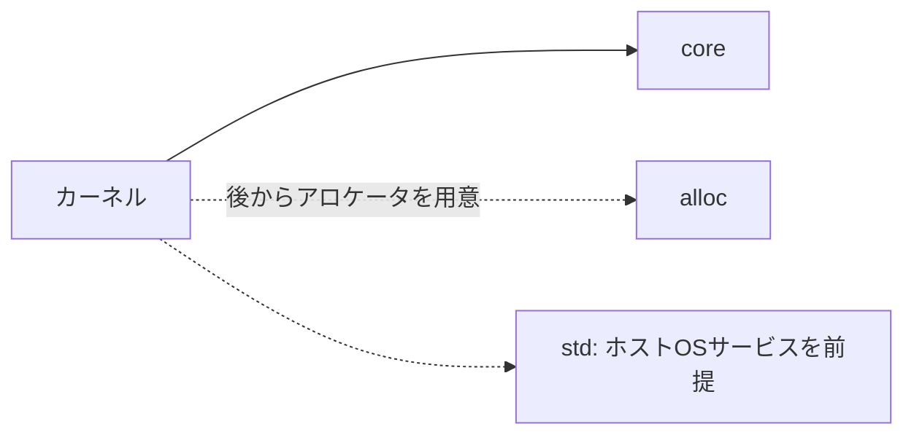

# 02. freestanding Rust

## 「Rustで書く」だけではOSにならない

通常のRustアプリはOSのサービスを使います。`println!`が画面に文字を出すときも、標準ライブラリとOSが背後で働きます。ファイルやスレッドを扱うAPIもOSへの依存を持ちます。こうしたホストOSの実行環境に依存しないプログラムをfreestanding（独立実行型）と呼びます。[25]

freestandingは「Rustの便利な機能をすべて禁止する」という意味ではありません。`core` は整数、スライス、基本的なトレイトなど、OSに依存しない言語の基礎を提供します。一方 `std` はOSの機能やランタイムを含むため、カーネルの初期段階では通常使えません。メモリ確保を伴う `alloc` は、カーネルがグローバルアロケータを用意した後に利用できるようになります。依存関係は概念的に次のようになります。



この境界を理解すると、標準出力がなくてもRustの型検査や所有権が使える理由が見えてきます。これらはコンパイル時の言語機能です。低レベルの生ポインタ操作や割り込みハンドラにはRustが安全性を保証できない部分が残るため、`unsafe`を適切に隔離します。

`core` はヒープを必要としない機能を中心に提供するため、カーネルの最初期でも利用しやすい一方、標準ライブラリに慣れた開発者には不足を感じます。ファイル操作や時刻取得、スレッド生成はOSが提供するサービスです。カーネル内で必要になる機能は、対応するサブシステムを設計して初めて使えるようになります。存在しないサービスを別名の関数で隠すと依存先が分かりにくくなります。どの層が機能を提供するかを明示しましょう。

## 実行時に誰が何をするのか

### bootloader_api 0.11.12の最小入口

freestandingなカーネルは通常の`main`を持たず、起動側との入口契約を満たす関数を用意します。bootloader_api 0.11.12では`entry_point!`マクロに通常のRust ABIを使う関数を渡し、型は`fn(&'static mut BootInfo) -> !`です。マクロはこの関数を検査し、リンカが使う`_start`を`extern "C"` ABIの入口として生成します。コールバックと生成シンボルのABIは異なります。[22][28]

次のコードは、入口関数とpanic handlerの形を示す断片です。Cargo設定やリンカ設定を含まないため、単独で起動できるプロジェクトではありません。[10][11]

```rust
#![no_std]
#![no_main]

use bootloader_api::{entry_point, BootInfo};

entry_point!(kernel_main);

fn kernel_main(boot_info: &'static mut BootInfo) -> ! {
    let region_count = boot_info.memory_regions.len();
    let _ = region_count; // 実際の教材では初期化済み出力先へ記録する
    loop {
        core::hint::spin_loop();
    }
}

#[panic_handler]
fn panic(_info: &core::panic::PanicInfo) -> ! {
    loop {
        core::hint::spin_loop();
    }
}
```

この例の`#![no_std]`は標準ライブラリをリンクしない指定、`#![no_main]`は通常のRust `main`を入口にしない指定です。`entry_point!(kernel_main)`がブートローダ向け入口を生成し、BootInfoへの可変参照を渡します。`'static`は参照がカーネルの実行期間にわたり有効であるという契約を表し、`mut`はカーネルが情報を更新できる型であることを示します。戻り値`!`は関数が戻らないことを表現します。panic handlerも戻れないので同じ型になります。ループ中の`spin_loop`はCPUへ待機中のヒントを与えるだけで、スケジューリングや安全な停止を実装するものではありません。

0.11.12以外を使う場合は、`entry_point!`の関数シグネチャ、BootInfo型、panic handlerの要件をその版のAPI資料で照合します。[22][28] Rustのコンパイルが通ることは、生成物がブートローダの期待する形式であることまでは保証しません。

通常の実行ファイルは、関数に入る前後にランタイムが初期化や終了処理をします。freestandingなカーネルでは、どの形式でロードされ、どのシンボルが入口で、どの呼び出し規約が必要かをブートローダとコンパイラ設定の間で合わせます。リンカは複数のオブジェクトファイルを一つの実行形式にまとめ、各セクションの配置やシンボル参照を解決します。リンク設定を誤ると、ソースコードが正しくてもブートローダが読める形式にならないことがあります。

公式basic exampleはkernelを別クレートとしてビルドし、artifact dependencyで成果物をビルド側へ渡します。[10][11]

artifact dependencyは、別クレートが生成したバイナリをビルド時の入力として扱うCargo機能です。公式例では実験的な`bindeps`設定とnightlyツールチェーンを使います。利用するRustツールチェーンの説明を確認してください。[10][11]

公式例はBIOS用とUEFI用の成果物を扱います。この教材の実行確認はUEFI経路を使い、ブートローダ自体の実装やBIOS用イメージ作成は課題にしません。[10][13] ターゲットと依存バージョンは参照時点の構成に合わせて確認します。

```text
ソースコード → Rustコンパイル → リンク → カーネル成果物
                                      ↓
                              ブートローダがロード
```

カーネルで `panic!` が起きたときも、通常アプリのように端末へ表示したりプロセスを終了したりする仕組みは自動ではありません。panic handler（パニック処理関数）を用意し、最低限、原因を診断経路へ出して安全な停止状態へ移る必要があります。初期段階で無限ループに入る例は、戻り先のOSがないことを反映しています。ただし割り込み禁止やCPU停止命令など、停止方法の正しさは目的に応じて検討します。

ビルドターゲットも重要です。ターゲットは、生成するコードがどのCPU命令セット、ABI、OS環境を想定するかを指定します。ホスト用バイナリを作ってからブートローダへ渡せばよいとは限らず、カーネル用ターゲットとUEFI用の成果物ターゲットは役割が異なります。コンパイルが成功した場合でも、リンクされた実行形式が意図した環境向けか、必要なシンボルやセクションが含まれるかを確認します。公式例の設定はその確認の手掛かりですが、機械的にコピーして終わりにせず、各設定が何を変えるかを読むことが大切です。[10][11]

## 出力とメモリの前提を自分で置く

`println!`の代わりにシリアル出力やフレームバッファ用の関数を作ると、OSが暗黙に担っていた機能が見えてきます。画面へ文字列を出すには、書き込む装置やアドレス、データ形式を知る必要があります。後の章ではbootloader_apiが渡すフレームバッファを使います。VGAテキストメモリの記事は、別の出力方式を学ぶ比較材料として読みます。[3][23]

出力関数を作るときは、出力先の確保や排他制御にも注意します。panic handlerから通常のログ機構を呼ぶと、その内部で再びpanicしたり、保持中のロックを取り直して停止したりすることがあります。通常時の高機能なログと、障害時の最小限の緊急出力を分けると、依存するサービスと責任範囲を明確にできます。

`Vec`や`Box`を使うには、確保先となるヒープが必要です。最初はスタック上の固定配列や静的領域で始め、メモリ管理の基盤が整ってから`alloc`を接続します。便利なAPIの背後にある要求を一つずつ明示してください。

`#![no_std]`は標準ライブラリを外す設定です。起動時にはentry point、ターゲット、リンク設定、panic handler、ブートローダとのABIをそろえます。`unsafe`が省くのはRustの一部の安全性チェックです。アドレスが有効か、書き込み可能か、装置がその形式を受け付けるかは別に確かめます。

## 手を動かす

ホスト上で動く小さなRust例を一つ選び、`println!`、`Vec`、`Box` がそれぞれどのサービスを必要とするか表にしてください。次に、固定長バッファと `core` の機能だけで同じデータ処理を表現できるか考えます。カーネル例をビルドするときは、依存crateのターゲット、nightly機能の有無、生成された成果物の形式を確認します。成功を「コンパイルが通った」だけにせず、ブートローダがその形式を受け取るところまで確認してください。

Phil Oppのfreestanding binary解説は、標準ライブラリやリンカの境界を考える補助資料になります。[25] 次章では、OSなしで画面に出す最初の具体例として、ピクセル形式とメモリ配置からフレームバッファコンソールを組み立てます。

## Sources

[3] https://os.phil-opp.com/ja/vga-text-mode — VGAテキストモード
[10] https://raw.githubusercontent.com/rust-osdev/bootloader/main/examples/basic/basic-os.md
[11] https://raw.githubusercontent.com/rust-osdev/bootloader/main/examples/basic/Cargo.toml
[13] https://raw.githubusercontent.com/rust-osdev/bootloader/main/examples/basic/build.rs
[22] https://docs.rs/bootloader_api/0.11.12/bootloader_api/info/struct.BootInfo.html — BootInfo in bootloader_api::info 0.11.12
[23] https://docs.rs/bootloader_api/0.11.12/bootloader_api/info/struct.FrameBuffer.html — FrameBuffer in bootloader_api::info 0.11.12
[25] https://os.phil-opp.com/ja/freestanding-rust-binary — フリースタンディングな Rust バイナリ | Writing an OS in Rust
[28] https://docs.rs/bootloader_api/0.11.12/bootloader_api/macro.entry_point.html — entry_point! macro in bootloader_api 0.11.12
