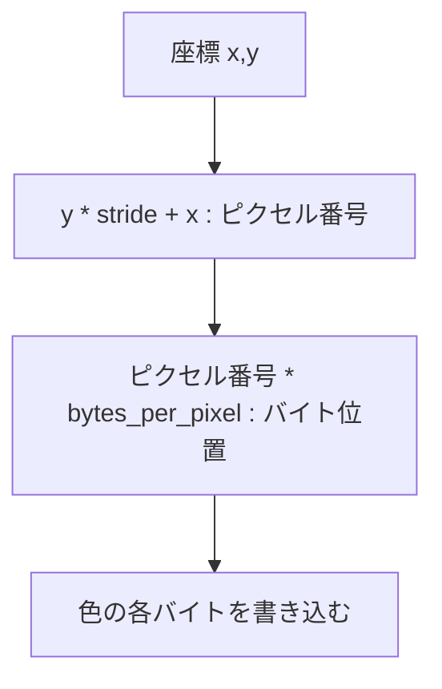

# 03. フレームバッファコンソール

## ピクセルから文字を描く

カーネルが起動したことを人間に伝えるには、何らかの出力が必要です。一般的なアプリなら端末に文字列を書きますが、その端末を管理するOSがまだありません。bootloader_apiは利用可能な場合にフレームバッファ情報をカーネルへ渡します。フレームバッファとは、画面に対応づけられた画素データをメモリとして扱う領域です。[22][23]

ここで使うのは `FrameBuffer` と `FrameBufferInfo` です。前者は書き込み対象となるバッファへのアクセスを提供し、後者は幅・高さ・stride・ピクセル形式など、バイト列を解釈するための情報を表します。API資料の型やメソッドを使用する版で確認してください。[23][24] 画面が必ず存在するとは限らないため、受け取った値がないときは別の診断方法へ切り替えます。

「画面のメモリを直接書き換える」と表現すると単純に聞こえますが、実際にはブートローダがそのバッファをどのようにマップして渡すか、CPUから書き込み可能かという前提があります。通常メモリと装置メモリではキャッシュや書き込みの意味が違う場合もあります。APIが提供する安全なアクセス方法があるならそれを優先し、生ポインタを扱う箇所は範囲と寿命を限定します。バッファの存在を確認せず固定アドレスへ書く実装は、この教材の目的から外れます。

VGAテキストモードでは文字セルの値を書き込む説明がよく使われますが、この教材の基本題材はフレームバッファです。Phil OppのVGA記事は歴史的・概念的な比較には役立ちますが、そこにある0xb8000への書き込みを本教材の課題にしません。[3]

## 画素の位置からバイト位置へ

画面上の座標 `(x, y)` はピクセル単位です。一方、バッファはバイト列です。`stride` は1行分の幅をピクセル数で表し、`bytes_per_pixel` は1画素が占めるバイト数です。したがって、行の先頭から対象画素までのバイト数は次の式になります。

```text
offset = (y * stride + x) * bytes_per_pixel
```

`stride` を幅と同じ値だと決めつけてはいけません。行末に余白がある場合、strideは表示幅より大きくなります。たとえば表示幅が800ピクセル、strideが832ピクセル、bytes_per_pixelが4の画面で `(x=10, y=2)` を描くと、`(2*832+10)*4 = 6696` です。これはバッファ先頭から数える0始まりのバイトオフセットであり、「6696バイト目」という1始まりの位置ではありません。単純に `y*800` とすると、2行目以降で位置がずれてしまいます。

式の各段階を単位で追うと、なぜ掛け算の順序が必要かが分かります。`y * stride` は先行する行に含まれるピクセル数、そこへ `x` を足すと先頭から数えたピクセル番号です。最後に1画素のバイト数を掛けて、バッファ先頭からのバイトオフセットに変換します。もし最初から `bytes_per_pixel` をstrideに掛けて扱う別の式を使うなら、そのstrideはバイト単位です。本教材の `stride` はピクセル単位なので、異なる定義を混ぜないことが要点です。



bootloader_api 0.11.12の`PixelFormat`は`Rgb`、`Bgr`、`U8`、`Unknown`を区別します。`Rgb`と`Bgr`は色成分の並び順、`U8`はグレースケール値を表します。`Unknown`には赤・緑・青それぞれのビット位置が入るため、名前だけから配置情報がないと判断してはいけません。`PixelFormat`にはアルファチャンネルの有無を示す項目はありません。[24][26]

`bytes_per_pixel`は1画素を保存するための領域幅です。RGB/BGRでは3バイトより大きい場合もありますが、余分なバイトがアルファ値だとは限りません。最初の実装で未対応の形式に出会ったら、色の意味を推測して書き込まず、明示的に拒否します。

概念的な処理は次のようになります。実際の `FrameBuffer` の借用方法やバッファ取得APIは版のドキュメントを参照してください。

```rust
// 概念コード。呼び出し前に形式とbytes_per_pixelの対応を確認する。
fn pixel_range(x: usize, y: usize, width: usize, height: usize,
    stride: usize, bpp: usize, buffer_len: usize)
    -> Option<core::ops::Range<usize>>
{
    if x >= width || y >= height || x >= stride || bpp == 0 {
        return None;
    }
    let index = y.checked_mul(stride)?.checked_add(x)?;
    let start = index.checked_mul(bpp)?;
    let end = start.checked_add(bpp)?;
    (end <= buffer_len).then_some(start..end)
}
```

この断片は考え方を示す概念コードで、FrameBufferからのスライス取得や色の書き込みは含みません。

`checked_mul`と`checked_add`は上限超過を`None`にし、折り返した値を有効位置と誤認しないために使います。

`Range`の終端は含まないため、最後の有効バイトの直後を`end`として扱います。

呼び出し側は`Rgb`ならRGB順、`Bgr`ならBGR順を選び、仕様に合わない保存幅や`Unknown`を拒否します。`U8`はグレースケール値として扱い、RGBカラー形式とは分けます。[24][26]

実装は順に進めます。まずフレームバッファの有無を調べます。次に形式を許可リストと照合し、座標とバッファ範囲を検査してから書き込みます。範囲計算を画面に依存しない純粋関数にすると、画面を書き換えずに検証できます。

## 画素から文字へ段階的に進む

最初に画面を一色で塗り、そのあと数ピクセルの矩形を描けば、アドレス計算と色形式を独立して確かめられます。次に文字のビットマップを用意し、各ビットを前景色・背景色に対応させれば文字描画になります。フォントとは文字の形を小さな画素パターンで記述したものです。文字列を折り返すには、文字幅、行の高さ、画面端で次の行に移る条件が必要です。スクロールまで実装するなら、上の行を下へコピーするか、論理的な描画位置を移す処理も加わります。

コンソールはカーソル位置、色、改行後の移動、画面端の扱いを管理します。まず固定幅フォントと画面全消去だけに絞ると、異なる問題を混ぜずに検証できます。

文字を表示するとき、UTF-8の文字列を1バイトずつ文字として描くのも誤りです。日本語などの文字は複数バイトで表現されるため、文字コードを文字単位に解釈し、その文字に対応するグリフを選ぶ必要があります。最初の教材では英数字のみの固定幅フォントに限定するのが現実的です。その限定を明記すれば、文字コード処理と画素描画を同時に実装せずに済みます。後から多言語へ広げる際は、フォント形式やグリフ検索を別の機能として追加できます。

描画を確認するときは、見た目だけに頼らず数値も検査します。矩形の四隅の座標、各行での先頭offset、最後に書き込むバイト位置を計算し、バッファ長より小さいことを確かめます。画面全体を塗る処理は単純ですが、ループの上限を誤ると最後の行を越えて書きます。表示サイズと実際のバッファ長が整合しない場合に備え、利用可能な情報の範囲を検証する設計が必要です。

## 手を動かす・確認する

1. `FrameBufferInfo` の幅・高さ・stride・bytes_per_pixel・ピクセル形式を読み、単位をメモします。
2. `pixel_range` が返す範囲を計算し、左上 `(0,0)` と右隣 `(1,0)` の先頭offsetの差がbytes_per_pixelになることを確認します。
3. 画面内に一つの小さな矩形を描き、境界外座標は拒否するようにします。
4. strideが幅より大きい仮想例を計算し、幅をstrideの代わりに使った場合との差を説明します。

確認方法は、画面全体を塗る、端に近い座標を描く、異なる色を並べるという順です。毎回一つの変数だけ変更すると、座標計算と色形式のどちらが原因か特定しやすくなります。API資料のFrameBufferInfoとPixelFormatを参照し、バッファ長を越える計算にならないことも確かめてください。[24][26]

画面幅、stride、bytes_per_pixel、ピクセル形式は実際に渡された値から読み取ります。矩形を描く課題では、各行の先頭位置と色の保存順を別々に確かめます。次章では、無効なアドレス参照などをCPUがどう通知するかを学び、画面表示だけでは不十分な障害診断へ進みます。

## Sources

[3] https://os.phil-opp.com/ja/vga-text-mode — VGAテキストモード
[22] https://docs.rs/bootloader_api/0.11.12/bootloader_api/info/struct.BootInfo.html — BootInfo in bootloader_api::info 0.11.12
[23] https://docs.rs/bootloader_api/0.11.12/bootloader_api/info/struct.FrameBuffer.html — FrameBuffer in bootloader_api::info 0.11.12
[24] https://docs.rs/bootloader_api/0.11.12/bootloader_api/info/struct.FrameBufferInfo.html — FrameBufferInfo in bootloader_api::info 0.11.12
[26] https://docs.rs/bootloader_api/0.11.12/bootloader_api/info/enum.PixelFormat.html — PixelFormat in bootloader_api::info 0.11.12
