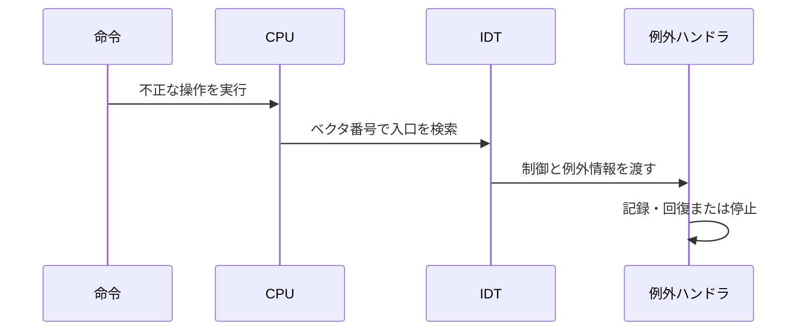

# 04. CPU例外

## 例外はCPUから届く同期的な通知

CPU例外は、命令の実行中に検出された異常や特別な条件をCPUがカーネルへ知らせる仕組みです。たとえばゼロ除算、無効な命令、ページフォルトがあります。ページフォルトは未マップの仮想ページだけでなく、読み書き・実行の権限に違反したアクセスでも発生します。[14][17] 外部デバイスから後で届く割り込みとは異なり、例外は現在実行している命令と強く結びついています。どの例外が起きたかを正しく記録しなければ、障害位置や原因の診断を誤ります。

CPUは例外を起こしたとき、あらかじめ設定された割り込み記述子テーブル（IDT）を参照します。IDTは例外・割り込み番号ごとに、制御を渡すハンドラや属性を記述する表です。ハンドラを正しく動かすには、CPUが要求するABIに加え、例外時のスタック配置や復帰手順をRustの割り込みハンドラ機構に合わせます。[14][15]

例外の番号をベクタと呼び、CPUはベクタを手掛かりにIDT内の対応項目を探します。表の項目には、コードの入口だけでなく、どの特権レベルで実行するか、必要に応じて別スタックへ切り替えるかなどの情報が関係します。通常の関数ポインタを配列へ並べればよいという構造ではありません。ライブラリの抽象化を使う場合でも、登録したハンドラがCPUの要求する入口規約を満たすかを確認してください。[14][15]



例外の種類によって、CPUがスタックへ保存する情報やエラーコードの有無が異なります。ハンドラが同じ引数を受け取るとは限らないため、IDTを設定するだけでなく、各例外の仕様を個別に確認します。Phil Oppの例外記事は代表的な例外とハンドラ設計の補助資料です。[14]

ブレークポイント例外は、デバッガ用の `int3` などで意図して発生させる同期例外で、通常はエラーコードを伴いません。ページフォルトはメモリアクセスがページングの存在・許可条件を満たさないときに発生し、CPUは原因を表すエラー情報を用意します。どちらもIDTを通りますが、保存情報と原因の読み方は異なります。[14][17]

```text
概念上の経路（実際のRust型・属性は利用APIに合わせる）
命令実行 → CPUがベクタと必要な復帰情報を保存
         → IDTの該当ゲートを参照
         → 必要なら特権スタックまたはISTへ切り替え
         → ABIに合う例外入口が保存情報を読む
         → 記録して停止、または安全な復旧を行う
```

この順で追うと、IDTにCPUが例外時に必要とする入口情報が記述されていると分かります。通常のRust関数呼び出し規約だけでは、CPUが用意する例外時のスタック配置や復帰形式を扱えないため、対応する入口機構を使います。

例外発生時にCPUが保存する命令位置は、例外の性質により「問題の命令を再実行する位置」か「次の命令へ進む位置」かが異なります。記録したアドレスをただインクリメントすれば復旧するわけではありません。たとえば命令を飛ばせばプログラム状態が壊れますし、同じ問題命令へ戻れば例外が再発する場合もあります。カーネル初期段階では自動回復より、再現に必要な情報を出して停止する方が安全なことが多い理由です。

## Double faultを最後の安全網にする

Double fault（二重フォルト）は、CPUが定める特定の例外組み合わせで、例外配送中の失敗がDouble faultへ昇格したときに発生します。例外処理中に次の例外が起きても、すべてがDouble faultになるわけではありません。たとえば最初の例外を処理するためのスタックが使えない場合、ハンドラに到達する前にさらに深刻な状態になることがあります。Double fault用の専用スタックを備えるIST（Interrupt Stack Table）を構成すれば、通常スタックが壊れた状況でも別のスタックで診断できる場合があります。詳細はCPUと環境の仕様に従います。[15]

ISTは例外時に使うスタックを指定する仕組みであり、double faultの原因を修復するものではありません。IDTのdouble fault項目を専用ISTスタックへ結び付けると、CPUがその項目を選んだときに別スタックへ移ります。そのため領域の確保・マッピング・設定の対応がすべて必要です。[15]

```text
例外処理中に別の例外 → CPUが定める例外組み合わせを判定
                      ├─ 昇格条件に該当しない → 対応する例外を処理
                      └─ 昇格条件に該当する   → Double fault
                                                  ↓
                                           専用ハンドラ/IST
```

Double fault handlerは、最後の診断地点として役立ちますが、原因そのものを直す機構ではありません。シリアル等に例外番号や命令位置を出し、再現条件を残した上で停止する設計が基本です。無限にログを書き続けたり、壊れたロックを再取得したりすると、二次障害を起こします。例外経路では使える機能を絞るのが有効です。

Double fault用の専用スタックは、通常スタックでハンドラへ移ること自体が失敗する場合に備えます。専用スタックの範囲、アラインメント、マッピングを正しく準備し、CPUがdouble fault時にその領域へ切り替える設定を確かめます。[15] 例外をわざと誘発する試験には、仮想マシンのスナップショットなど復旧可能な環境を使い、終了後に通常経路が残っていることも確認します。

## 例外処理の流れを組む

起動後、まずIDTを作り、特に診断したい例外の入口を登録し、CPUがそのIDTを使うようにします。全例外に独自の複雑な処理を実装する必要はありません。初期段階では、例外名、命令位置、エラーコードなど取得可能な情報を安全な出力先へ出し、回復できないものは停止させます。実際のフィールドやハンドラ宣言は採用するCPUクレートとAPIに依存します。

登録手順の前後関係にも意味があります。空のIDTをCPUに使わせてからハンドラを追加すると、その間に例外が入ったときに有効な入口がありません。必要な項目を完成させてからCPUへロードする順序にすれば、その危険を減らせます。割り込みを有効にする時点も独立して考えます。例外テーブルを利用可能にすることと、外部割り込みを配送可能にすることは同じ操作ではありません。

Rustの通常の関数は、割り込み時のスタック配置やレジスタ保存を自動では満たしません。専用の関数属性やアセンブリの入口が必要となる理由は、CPUが定めた復帰形式を守るためです。ハンドラでpanicを起こすと、panic handlerとの再帰的な問題が生じる可能性もあります。最小限の出力と停止を優先してください。

## 手を動かす・確認する

**概念演習（紙上で実施）:** この章の前半にあるbreakpointとpage faultの例を使い、それぞれがCPUからIDTを経てハンドラへ届く経路を追跡してください。エラーコードの有無など保存情報の違いを表にします。合格条件は、両者がIDTを通ること、breakpointは通常エラーコードを伴わずpage faultは原因を示すエラー情報を持つこと、保存された命令位置の意味を区別して記述できることです。Double fault用ISTは構成図または設定資料の確認だけにとどめ、発生させません。

**任意のカーネル統合:** 起動可能なx86_64カーネルの土台、IDT/例外入口を設定する機構、診断出力が必要です。例外を試す場合は復旧可能なVM内に隔離し、意図した例外と診断記録を観測でき、通常起動が続行できるかを確認してください（停止設計の場合はVMを復旧して通常起動を別途確認）。Double-fault ISTは図・設定の点検のみで、誘発試験は行いません。

例外ハンドラを用意しても、すべての状況から安全に復帰できるわけではありません。命令を再実行できるか、状態を復旧できるかは例外ごとに判断します。IDTを使える状態にしてから例外が入るよう、初期化順序も診断対象に含めます。次章ではページフォルトの背景となる仮想アドレス変換とページテーブルを詳しく見ます。

## Sources

[14] https://os.phil-opp.com/ja/cpu-exceptions — CPU例外 | Writing an OS in Rust
[15] https://os.phil-opp.com/ja/double-fault-exceptions — Double Faults | Writing an OS in Rust
[17] https://os.phil-opp.com/ja/paging-introduction — ページング入門 | Writing an OS in Rust
