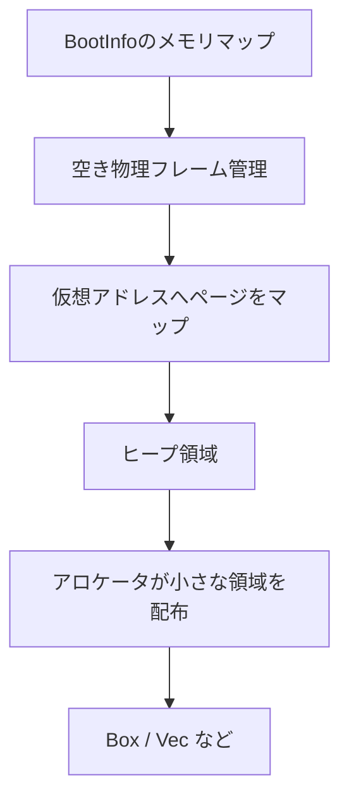

# 06. ヒープアロケータ

## 固定サイズ以外のメモリが必要になる

カーネルの初期化では固定長の配列で足りることがあります。しかしログ行数、デバイス数、タスク数が実行中に変わると、配列サイズを事前に決めるのは難しくなります。ヒープは、実行中に要求された大きさのメモリ領域を貸し出す領域です。アロケータは、要求に合う空き領域を探し、確保・解放を記録する管理器です。Rustの `Box` や `Vec` を利用するにも、カーネルがこの仕組みを用意する必要があります。

ヒープを用意する前提として、物理フレームを確保して仮想空間へマッピングする段階があります。フレームアロケータはページサイズ単位の物理フレームを管理し、ヒープアロケータはその上に細かいバイト単位の割り当てを行います。両者を一つの機能と誤解しないでください。

ヒープを使わずに済む期間を長く保つ設計にも価値があります。起動直後はBootInfoの領域一覧を順番に処理し、固定長の診断バッファを使うだけで足りるかもしれません。アロケータを早く有効にすると、その初期化自体のログやエラー処理がアロケータに依存する循環が生じます。まずアロケータなしで失敗を観察できるようにし、その後で動的確保を段階的に導入すると切り分けやすくなります。



## 要求サイズとアラインメント

確保要求にはサイズだけでなく、アラインメント（先頭アドレスを揃える境界）があります。たとえば16バイト境界が要求されるなら、返すポインタのアドレスは16の倍数でなければなりません。サイズ24バイト、アラインメント16バイトの要求では、空き領域の先頭に最大15バイトの調整が入り得ます。小さな要求を繰り返すと、使えない隙間が増えることがあります。

単純なbump allocator（先頭位置を進める方式）は、確保ごとにカーソルを前へ動かし、解放を個別に再利用しません。初期化段階では構造が簡単ですが、長期間の利用では領域を使い切ります。free-list allocator（空きリスト方式）は、解放された領域をリストに戻して再利用しますが、分割・結合や破損したリストへの対処が必要です。どの方式にも、速度、断片化、実装難度のトレードオフがあります。[19][20]

```text
空き: [----------------------------------------]
要求A: [AAAAAA]   残り: [------]
解放後: [空き][AAAAAA][空き]  → 隣接領域をまとめられるか？
```

アラインメントを扱うbump方式では、カーソルを要求境界まで切り上げ、その位置から要求サイズを足します。次はアドレス計算を示す概念コードで、実際のカーネルでは整数幅やポインタの有効性も確認します。

```rust
// 固定領域を順に使う概念コード。解放処理は持たない。
fn allocate(cursor: usize, end: usize, size: usize, align: usize) -> Option<(usize, usize)> {
    if align == 0 || !align.is_power_of_two() { return None; }
    let mask = align - 1;
    let start = cursor.checked_add(mask)? & !mask; // 境界へ切り上げる
    let next = start.checked_add(size)?;
    if next > end { return None; }
    Some((start, next)) // (返す開始位置, 次回カーソル)
}
```

例としてカーソル `0x1003`、サイズ10、アラインメント8なら、開始位置は `0x1008`、次のカーソルは `0x1012` です。切り上げによる隙間も消費済みになり、末尾超過や加算オーバーフローは失敗になります。bump方式は以前の確保位置を個別に記録しないため、解放しても領域を再利用できず、長期間使うと空き領域が尽きます。初期化中など寿命をまとめて終えられる用途に向く理由です。[19][20]

外部断片化は、合計の空き容量が十分でも、連続した大きな領域がないため要求を満たせない状態です。内部断片化は、割り当て単位やアラインメントの都合で、確保した範囲の内側に未使用部分ができる状態です。単に「総空きバイト数」を数えるだけでは、割り当て可能性を判断できません。

アロケータは空き領域をどの順で探すかでも性質が変わります。最初に条件を満たす領域を使うfirst-fitは実装しやすく、サイズの近い領域を優先するbest-fitは一見無駄が少なく見えるものの、小さな穴を多く作る場合があります。どの方式が優れているかは要求の分布や計測に左右されます。教材の段階では複雑な最適化を加えるより、割り当てと解放の不変条件を守れているかを明らかにしましょう。

## Rustのグローバルアロケータと安全性

Rustのアロケータ連携は、要求されたLayout（サイズとアラインメント）に合う領域を返し、解放時に対応する領域を受け取る契約に従います。実際のAPIやunsafe traitの形はRustバージョンを確認してください。誤ったサイズで解放する、二重に解放する、確保済み領域を重ねて返すと、メモリ破壊につながります。アロケータ本体が安全なインターフェースを提供できるよう、危険な操作を狭い範囲へ閉じ込めます。

割り当て失敗の扱いも設計の一部です。要求を満たせないときにnull相当の結果を返す契約なのか、呼び出し側が失敗を処理するのか、panicへ進むのかを明確にします。アロケータ内部でログ用の `String` を作ると、その確保が再びアロケータを呼び、再帰する危険があります。低メモリ状態では、診断経路を固定バッファにするなど、通常時と同じ便利さに依存しない工夫が必要です。

割り込みハンドラと通常処理の両方から同じアロケータを使う場合、同時アクセスを防ぐ必要があります。しかしハンドラがロック取得中に割り込むと、同じロックを再取得しようとして停止する危険があります。割り込みを一時的に抑止する、割り込み専用の領域を設けるなど、設計の選択は実行環境に合わせます。単一CPUだから競合しないと決めつけず、割り込みによる再入も考慮しましょう。

Phil Oppのヒープ解説とアロケータ設計比較は、単純な方式から設計上の難しさへ進む補助資料です。[19][20] ヒープ領域をどこへ置くか、どのページを使えるかはbootloaderのマッピングとカーネルのフレーム管理に依存します。利用可能なアドレスを推測で固定しないでください。

## 手を動かす・確認する

最初の課題では、固定範囲のbump allocatorを紙上で動かします。開始位置 `0x1000` からサイズ10・アラインメント8の確保を行うと、開始位置を8の倍数にそろえた後、次回位置を決めます。計算過程を記録し、確保が領域末尾を越える場合に失敗を返すことを確認します。次に、繰り返し確保と解放を行い、bump方式で解放領域が再利用されないことを観察します。

実装確認では、確保した各ポインタのアラインメント、範囲重複の有無、上限到達時の挙動を記録します。`Vec` の容量を増やす短い処理を試す場合も、panic時に診断できる出力を先に用意します。テストは小さなサイズから開始し、アロケータが使われる前に必要な初期化が完了しているかを確認してください。

ヒープを安全に利用するには、初期化順、アラインメント、失敗時の処理、割り込みとの同期をそろえます。次章では、デバイスから非同期に届く割り込みを受け、データをFIFOへ渡す設計を学びます。

## Sources

[19] https://os.phil-opp.com/ja/heap-allocation — ヒープ割り当て | Writing an OS in Rust
[20] https://os.phil-opp.com/allocator-designs/ja — アロケータの設計 | Writing an OS in Rust
