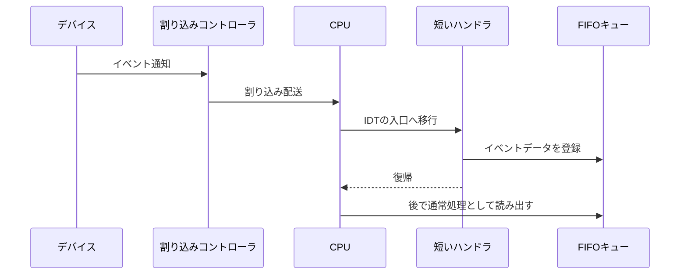

# 07. ハードウェア割り込み

## 外部から届く通知

CPU例外が実行中の命令に関連する通知なのに対し、ハードウェア割り込みはタイマーや入力装置など外部要因によって届きます。カーネルが装置を絶えず確認するポーリングでは、通知がない間もCPU時間を使います。割り込みを使えば、装置からイベントが届いたときにCPUが処理を開始できます。ただし割り込みを許可するまでに、ハンドラ、割り込み記述子、コントローラの設定を正しく準備する必要があります。

CPUへ割り込みを配送する仕組みは、世代や構成によって異なります。Phil Oppのhardware interrupts教材は8259 PICを扱うものであり、その具体手順を現代のすべてのPCへ普遍化してはいけません。[16] 現代環境では別の割り込みコントローラを使う場合があり、bootloaderや仮想マシンの設定によっても前提が変わります。この章では、装置通知がハンドラへ届き、処理系へ渡るという概念を学び、実機の設定は対象環境の仕様で確認します。

割り込みは通知を受ける側の準備ができる前に到着することがあります。そのため初期化中に割り込みを受け付けると、未初期化のキューやデバイス状態へハンドラが触れる危険があります。一般的には、ハンドラと共有状態を準備し、コントローラ・装置側の設定を整えた後で、適切なタイミングに配送を有効にします。どの段階で割り込みが抑止されているかは起動環境によって異なるため、暗黙の状態を確認する必要があります。

FIFO（First In, First Out、先入れ先出し）は、先に入ったイベントから順に取り出すキューです。ハンドラ側が末尾へ追加し、通常処理側が先頭から取り出すと、入力順を保ったまま処理を遅らせられます。

## ハンドラを短くする理由

割り込みハンドラは、通常処理の途中に予告なく入ります。そこで長い描画やメモリ確保を行うと、処理時間が延び、ロックの再入や他の割り込みとの競合を招きます。ハンドラでは必要最小限の状態を読み取り、確認応答を行い、後続処理へ小さなイベントを渡す設計が扱いやすいものです。装置固有の確認応答を怠ると、同じ通知が再び来たり、次の割り込みが止まったりする可能性があるため、手順は装置仕様で確認します。

ハンドラの実行中にはCPUが一部の割り込みを抑止する場合がありますが、すべての割り込みが自動で止まるとは限りません。優先度やネストの規則を理解せず、ハンドラから同じ種類の通知が再入できる設定にすると、スタックを使い切る危険があります。反対に、長時間すべてを抑止すればタイマーや他装置の応答を遅らせます。短いハンドラと後続処理への委譲は、応答性と安全性の両方を保つための設計です。

リングバッファで実装する場合、読み取り位置と書き込み位置を循環させます。満杯時に新規イベントを捨てるか、古いイベントを捨てるか、ハンドラを止めるかを決め、損失をカウンタやログで観測できるようにします。

リングバッファの例では配列の枠を4個、読み書き位置を0..3とし、空き枠を一つ残して空と満杯を区別します。この方式で同時に保持できるイベントは3個です。追加時に `next = (write + 1) % 4` を計算し、`next == read` なら満杯なのでイベントを捨て、オーバーフローカウンタを増やします。空きがあれば `buffer[write]` に書いてから `write = next` とし、取り出し側は `read != write` のとき読んで `read = (read + 1) % 4` とします。同時アクセスではこの例だけで同期を保証できないため、割り込みとの排他や原子操作も必要です。

EOI（End Of Interrupt）は、処理した割り込みをコントローラへ通知し、配送状態を完了させる応答です。8259 PICでは対応する割り込み完了の通知が必要ですが、必要なタイミングや宛先はコントローラ依存です。[16] 誤ると次の割り込みが届かないなどの問題になります。ハンドラは状態取得・必要な応答・キュー登録に絞り、解析や描画を通常処理へ回します。短くすることで割り込み遅延、再入、ロック競合を抑えられます。

キューを複数の実行文脈から使う場合は同期が必要です。ハンドラが書き込み中に通常処理が読む可能性があります。割り込みを抑止した短い区間で更新する、ロックフリー構造を使うなどの方法がありますが、メモリ順序や単一生産者・単一消費者という前提を理解して選びます。同期の設計を「割り込みは一つだから安全」と省略しないでください。

FIFOの設計では、データ本体だけでなく読み書き位置の更新が一つの論理操作です。データを書き終える前に書き込み位置を公開すると、消費側が未完成の値を読みます。逆に読み出し位置を早く進めると、同じ領域を生産側が上書きできます。リングバッファを使う際は、空状態と満杯状態をどう区別するか、容量を全枠利用するか一つ空けるかを決めてください。これらは小さな実装上の違いですが、取りこぼしの原因になります。

## 割り込み番号と装置イベント

装置からの割り込みはCPUのベクタへ対応づけられ、IDTのハンドラへ配送されます。例外と同じIDTを通るため、ベクタ番号の衝突や予約領域に注意します。どの装置をどのベクタへ割り当てるかは、コントローラの設定によります。割り込みを有効化する前にハンドラを登録するのは、通知が届いた時点で安全な入口が存在するようにするためです。

ハンドラから通常処理へ移る通知方法には、FIFOのほか、フラグやウェイクアップ信号があります。割り込みハンドラ内でタスク本体を動かすと、遅延が増えることがあります。ハンドラは「イベントが来た」と記録し、スケジューラ側で安全な時機に処理を進めます。この分担は後のasync章にもつながります。

## 手を動かす・確認する

**概念演習（紙上で実施）:** 容量4のリングバッファ（空き枠を一つ残すため実効容量3）に、消費者が読まない状態でイベントID 1、2、3、4、5を順に追加し、その後すべて読み出す手順を表にします。満杯時は新しいイベントを破棄し、破棄数を数えるものとします。合格条件は1、2、3を受け入れ、4、5を破棄し、破棄数が2、読み出し順が1、2、3となることです。

**任意のカーネル統合:** 起動可能なx86_64カーネルの土台に加え、対象コントローラの初期化、対象デバイス、対応ドライバ、IDT/ベクタとイベントキューの実装が必要です。ハードウェア試験は復旧可能なVM内に隔離します。合格条件は、デバイスイベント数とコントローラへの確認応答数を診断出力またはカウンタで観測でき、送受信の想定と一致することです。

8259 PICは割り込みコントローラの一つです。Phil Oppの記事はこのコントローラを題材とする具体例として読み、対象環境の仕様を確認します。[16] ハンドラ内の動的確保にはアロケータやロックの再入リスクがあります。次章では、FIFOに蓄えたイベントを待つ間にCPUを他の仕事へ回す協調的asyncを扱います。

## Sources

[16] https://os.phil-opp.com/ja/hardware-interrupts — ハードウェア割り込み | Writing an OS in Rust
