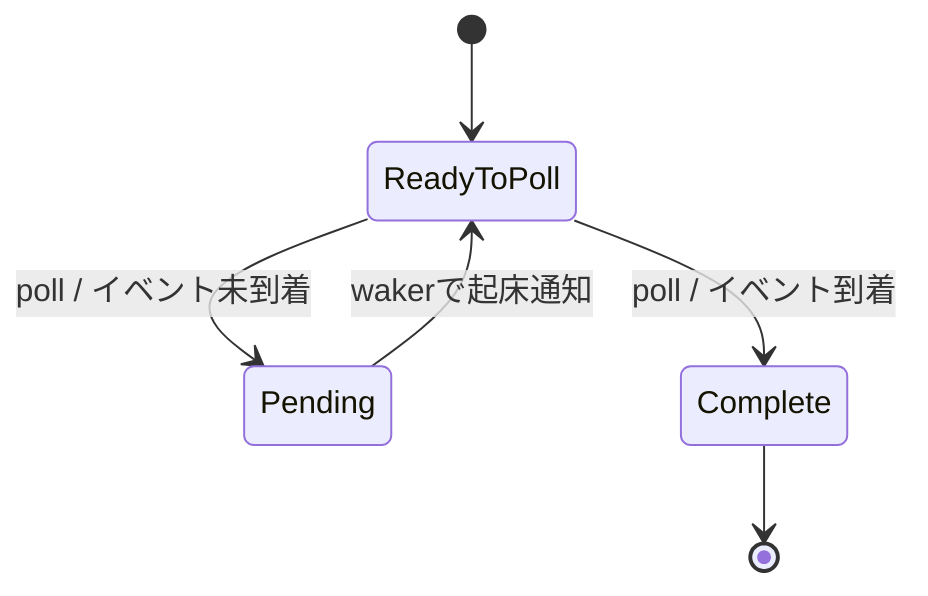

# 08. 協調的asyncタスク

## 待ち時間にCPUを空ける

デバイスからデータが届くまで何もしない処理があるとします。単純なループで状態を確認し続けると、CPU時間を消費し、他の処理を進めにくくなります。async/awaitは、処理が待ち状態になったときにいったん中断し、準備ができてから続きを再開するための言語機能です。OSで使う場合、Futureをいつ再実行するか決めるexecutor（実行器）が必要です。[21]

RustのFutureは、呼び出されると完了したか、まだ待機中かを返します。待機中を `Pending` といい、そのFutureは必要な状態を保持して後で再びpollされます。完了を `Ready` といいます。Future自身が勝手にバックグラウンド実行されるわけではありません。executorが `poll` を呼び、待機中なら再度呼ぶ時機を管理します。

Futureは一度のpollで関数の先頭から最後まで必ず進むものではありません。`async` 関数は、awaitをまたいで必要になるローカル変数を状態として保持します。pollのたびにどの段階から再開するかをコンパイラが状態機械として表現するため、呼び出し側からは通常の関数に似た構文で書けます。Futureを複数回pollする契約や、完了後のpollの扱いは標準APIの定義に従います。

Wakerは、Futureを再pollする準備ができたとexecutorへ知らせる通知手段です。executorは通知を受けてタスクを実行待ちキューへ戻します。[21]



`async fn` は概念的には、処理途中の状態を保存するFutureを作ります。`await` はFutureが完了していなければ現在の処理を中断可能にします。しかし、実際に他のタスクへ切り替わるにはexecutorがその待機を認識し、別のFutureをpollする必要があります。

## 協調的という言葉の意味

協調的タスク切り替えでは、タスクが待機点で自ら実行権を返します。CPUが任意の命令位置で強制的に切り替えるプリエンプティブ方式と違い、タスクが長い計算をawaitせず続けると、他のタスクは進みません。したがって「asyncにしたので並列になる」は誤解です。asyncは主に待ち時間を効率よく扱う仕組みで、複数CPUコアで同時に実行する並列性とは別です。

awaitが必ずスケジューラへの切り替えを意味するわけでもありません。await対象のFutureがすでにReadyなら、呼び出し元はそのまま続けて実行できます。切り替え可能な点を作ることと、その場で必ず別タスクへ移ることを区別します。遅い計算を小さな区間に分け、適切な地点でyieldする方法もありますが、過度な切り替えは状態保存やスケジューリングの負担になります。

イベントを待つFutureは、待機条件を登録して`Pending`を返します。ハードウェア割り込みがイベントをFIFOへ記録した後、関連するWakerでexecutorへ通知する設計が考えられます。イベントキューとタスクキューは役割が異なります。[21]

イベント到着とFutureの待機登録が競合すると、起床通知を取りこぼして永久待機することがあります。待機条件の確認、状態登録、通知の同期方法を一続きのプロトコルとして設計します。[21]

```text
Futureをpoll → Pending → executorは別タスクへ
                               ↓
                        装置イベント到着
                               ↓
                          Wakerを起こす
                               ↓
                          Futureを再poll
```

executorはFutureをpollする協調的な仕組みです。プリエンプティブ切り替えではタイマー割り込みなどが実行中タスクを強制中断し、CPU状態を保存して別タスクへ移します。Futureの状態遷移だけではレジスタやスタックの保存・復元を行わないため、async executorとCPUコンテキスト切り替えは別の仕組みです。

初期のexecutorは、タスクを順番にpollする単純なループでも構いません。ただし何も起きないタスクを何度もpollすると、ポーリングと同じ無駄が生じます。起床通知を記録して、起きたタスクだけキューへ入れる構造にすると効率が上がります。タスク状態をヒープ上に置く場合は、前章のアロケータが必要になり、タスクが自分自身を参照する構造を安全に扱う必要も出てきます。

Phil OppのAsync/Await記事は、Futureとexecutorの概念を学ぶ補助資料です。[21] 古い記事のAPIや実装は現在のRustや周辺クレートと異なる可能性があります。文章中の原理とコードの版を切り分け、採用する依存のドキュメントを確認します。

## 割り込みとタスクの責務分担

割り込みハンドラは短く保ち、データの記録と起床通知に集中させます。タスクは通常の実行文脈でデータを解析し、画面に表示し、必要なら追加の処理を待ちます。こうすると、割り込み処理の時間を抑えながら、複雑な処理をRustの通常の制御フローに近い形で記述できます。

FIFOが満杯のときにイベントを捨てるか、エラーとして扱うかを決めます。同じWakerが複数回呼ばれた場合の重複登録もexecutor側で処理します。割り込み側とexecutor側でキューを共有するなら、更新の同期方法を明示してください。

## 手を動かす・確認する

**概念演習（紙上で実施）:** タスクAとBをラウンドロビン順にpollする表を作ります。それぞれ最初のpollで`Pending`を一度返し、次のpollで`Ready`になるものとします。合格条件はトレースが`A-Pending, B-Pending, A-Ready, B-Ready`の順になることです。このモデルはpoll順を手で追う演習であり、正しいカーネルWaker/executor実装の代わりではありません。

**任意のカーネル統合:** 起動可能なカーネル土台、Futureをpollするexecutor、タスクを起床キューへ戻すWaker実装、そしてイベント発生源が必要です。イベント到着後に対象Wakerがタスクを起床待ちへ戻し、対象Futureが再pollされて`Ready`になることをログまたはカウンタで観測できれば合格です。イベントがない間に無制限の再pollをせず、別タスクが進むことも確認します。実機器を使う場合は復旧可能なVM内で試験します。

Future、executor、Wakerが連携すると、待機中の処理をイベント到着後に再開できます。次章では、この状態遷移を再現可能に観測し、カーネル特有のテストやデバッグへまとめます。

## Sources

[21] https://os.phil-opp.com/ja/async-await — Async/Await | Writing an OS in Rust
