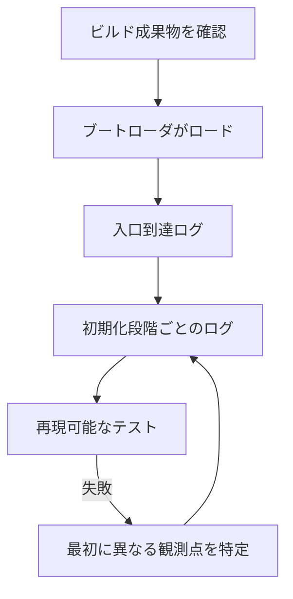

# 09. テストとデバッグ

## 見えない失敗を観測できる形にする

カーネルの障害は、一般的なアプリの例外表示とは限りません。画面が暗転する、CPUが例外ハンドラへ入れない、同じ割り込みを繰り返す、メモリ破壊で後から別の場所が壊れる、といった形で現れます。デバッグでは「失敗した」という事実だけでなく、どの段階まで正常だったかを記録する必要があります。

最初にシリアルなど、画面表示に依存しない観測経路を用意すると、フレームバッファ初期化の失敗とカーネル全体の停止を区別しやすくなります。公式basic kernelはシリアル初期化や情報出力を例にしています。[12] どの装置を使えるかは仮想マシンや実機設定に依存します。ログを出すコード自体がpanicやロック競合を起こす可能性もあるため、障害経路では単純な出力を選びます。

ログの内容は多ければよいわけではありません。時刻や連番があれば順序を追いやすく、段階名があれば最後に到達した境界を特定できます。メモリアドレスや長さを記録する場合は単位と表記をそろえます。反対に、毎ピクセルの描画や毎回のpollを大量に出すと、本当に重要なエラーが流れて見えなくなります。最初に必要最小限のイベントを決め、問題を再現した後に観測点を追加するのが効果的です。



ログは「初期化開始」「初期化完了」のような境界に置きます。すべての命令を出力すると、タイミングや割り込み動作を変え、根本原因を隠すことがあります。失敗直前の最後のログを確認し、次に実行されるはずの処理の前提を調べると切り分けが進みます。

## テストを層に分ける

純粋なアドレス計算やFIFOの順序処理は、ハードウェアに依存しない単体テストにできます。フレームバッファのピクセル位置計算も、バッファを書かずに期待オフセットを比較できます。ページテーブルや例外ハンドラのようにCPU状態が必要な機能は、仮想マシンでの統合テストが有用です。実機確認はデバイスやファームウェア固有の差を見つける最後の層になります。

```text
純粋関数のテスト → カーネル内の統合テスト → 仮想マシン → 実機
```

純粋関数の例は、アドレスをページ番号とoffsetへ分ける計算です。入力 `0x12345` とページサイズ `0x1000` に対して期待値 `(0x12, 0x345)` を比較すれば、ホスト上の通常テストで算術を確認できます。これはCPUのページテーブルや起動経路が正しいことまでは検証しません。別の確認として、公式 `examples/basic` のディレクトリ内で `cargo build` を実行してビルドを確認し、`cargo run uefi` でUEFI起動用の実行手順を試す例が公式資料に示されています。[10] これらは参照元の記述であり、この環境で実行した結果ではありません。起動確認には別途QEMUを用意する必要があります。[10]

公式basic exampleはBIOS用とUEFI用の成果物を作れますが、ここで行う起動確認はUEFI経路に限ります。BIOS向けイメージ作成やbootimageの手順は教材の範囲外です。[10][13]

公式basic-kernelはシリアル出力を診断経路として使い、`isa-debug-exit` をQEMU側で利用する例も示します。[12] シリアルは画面描画に依存しないログ経路、`isa-debug-exit` はテスト終了を仮想マシン側へ伝えるための仕組みです。これは公式例の説明であり、すべての実機や仮想化環境で同じ装置が使えるという意味ではありません。

テストでは成功条件を明示します。FIFOは追加順に取り出せること、ピクセル計算は隣接画素間のoffset差が`bytes_per_pixel`になることを確認します。アロケータでは要求アラインメントと確保範囲の重複を検査します。正常系に加えて、バッファ満杯や領域不足などの境界条件も試します。

Phil Oppのtesting記事には、当時の`bootimage`依存を使う方法が登場します。考え方の参考にはなりますが、ここで指定するbootloader 0.11.12と同じ起動手順ではありません。[27]

本教材は公式basic exampleを土台にし、bootloaderとAPIの版を合わせます。[7][10]

テストランナーやQEMU終了方法は、利用する版と環境で確認します。[10][11][13]

症状から確認箇所を選ぶときは、まず直前に正常だった境界を見つけます。

| 症状 | 調べる層 | 確認手順 |
|---|---|---|
| ビルドは通るがUEFI起動しない | 成果物・ブート設定 | 公式例の版と生成物を照合し、QEMUの起動ログと入口到達ログを順に確認する。[10] |
| 画面は暗いが停止位置が不明 | 出力経路・入口 | シリアルへ最小ログを出し、フレームバッファ障害とカーネル停止を分ける。[12] |
| ページフォルト | 仮想アドレス・ページテーブル | fault address、アクセス種別、該当ページのマッピングと権限を照合する。 |
| 割り込みが届かない | IDT・コントローラ・装置 | ハンドラ登録、配送設定、装置側通知、EOIの順に確認する。 |
| ホストテストは通るがQEMUで失敗 | 起動統合・CPU状態 | 純粋関数の確認結果と起動時のログを分け、最初に異なる境界を特定する。 |

## 障害の種類から手掛かりを得る

ページフォルトが起きたなら、対象仮想アドレス、アクセス種別、該当ページテーブルの状態を並べます。Double faultなら、最初の例外と例外処理中に使えなかった資源を調べます。割り込みが来ない場合は、ハンドラ登録、コントローラ設定、装置側の通知、有効化の順に確認します。画面が乱れるときは、strideと`bytes_per_pixel`、`PixelFormat`、バッファ長を順に照合します。症状に関連する章の前提を見直すと、原因を絞れます。

再現性も診断の一部です。同じ変更で毎回同じ地点に失敗するなら、その手順を小さくして原因を絞れます。一度だけ起きる障害は、割り込みのタイミングや未初期化メモリなど、時間に依存する状態を疑う手掛かりです。ログ追加で再現しなくなる場合は、タイミングが変わった可能性もあります。観測の影響を考えながら、最小の再現ケースやカウンタ、状態ダンプを使い分けてください。

QEMUの起動結果は仮想マシンでの確認です。実機ではファームウェアやデバイス構成が異なり、メモリマップも変わる場合があります。ログの数値やアドレスを固定値とみなさず、意味と範囲を検証します。コンパイル成功の後に、成果物の形式と起動時ABIを確認します。

## 手を動かす

これまでの課題の一つを選び、正常時と意図的な失敗時のログを設計します。ログには段階名、必要ならアドレスやサイズ、失敗理由を含めます。次に、純粋な計算部分をホストテスト可能な形に分け、境界条件を検査します。カーネル全体の試験では起動から終了までを自動化できる環境を整え、テストが成功した根拠となる出力を保存します。

最後にbootloaderとbootloader_apiの版を記録します。[8][22]

nightly、bindeps、UEFI成果物の条件は公式例と照合し、別環境で再現できるようにしてください。[10][11][13]

この章で学んだのは、デバッグが最後に付け足す作業ではないということです。観測可能性を最初から設計すれば、メモリ、例外、割り込み、asyncの因果関係を確かめられます。次に学ぶ機能へ進むときも、まず何を観測すれば正しさを判断できるかを考えてください。

## Sources

[7] https://github.com/rust-osdev/bootloader — rust-osdev/bootloader README
[8] https://docs.rs/bootloader_api/0.11.12/bootloader_api — bootloader_api 0.11.12 docs
[10] https://raw.githubusercontent.com/rust-osdev/bootloader/main/examples/basic/basic-os.md
[11] https://raw.githubusercontent.com/rust-osdev/bootloader/main/examples/basic/Cargo.toml
[12] https://raw.githubusercontent.com/rust-osdev/bootloader/main/examples/basic/kernel/basic-kernel.md
[13] https://raw.githubusercontent.com/rust-osdev/bootloader/main/examples/basic/build.rs
[22] https://docs.rs/bootloader_api/0.11.12/bootloader_api/info/struct.BootInfo.html — BootInfo in bootloader_api::info 0.11.12
[27] https://os.phil-opp.com/ja/testing — テスト | Writing an OS in Rust
